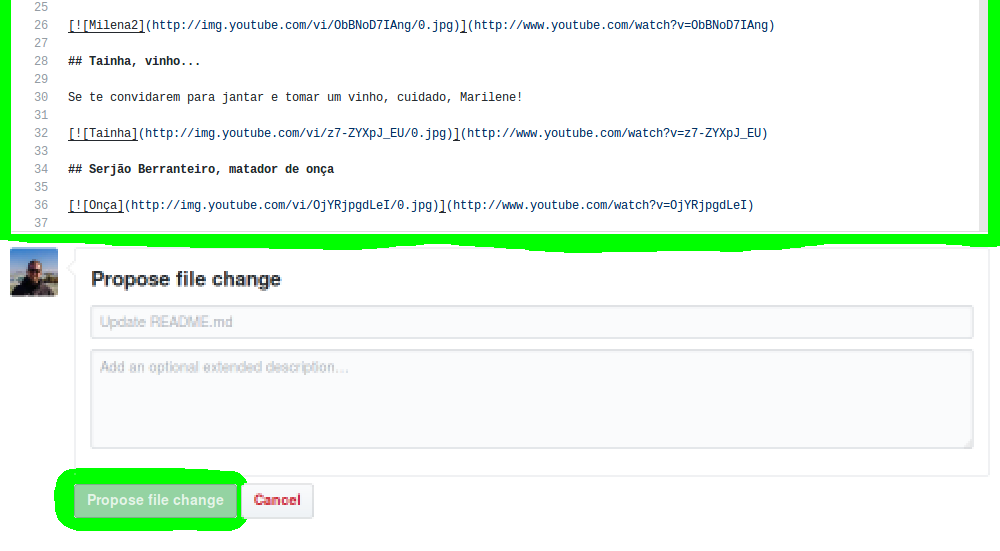

REGRAS DE CONTRIBUIÇÃO
======================

1. Não incluir nudes;
2. As contribuições podem ser feitas em pt_BR, preferencialmente, podendo ser em en(english), pt(Português) ou es(Espanhol);
3. As postagens devem incluir um thumbnail.
4. Cada commit deve estar relacionado a um meme. 

# Como contribuir

__1: Clique em `README.md` para abrir este arquivo.__


__2: Clique no lápis para entrar em modo de edição. Repare no formato correto de cada meme:__
```
[](link do vídeo)
```


__3: Faça as edições desejadas e clique em `Propose file change` para enviar a solicitação de atualização do arquivo no repositório original.__



__4: Envie o Pull Request__

